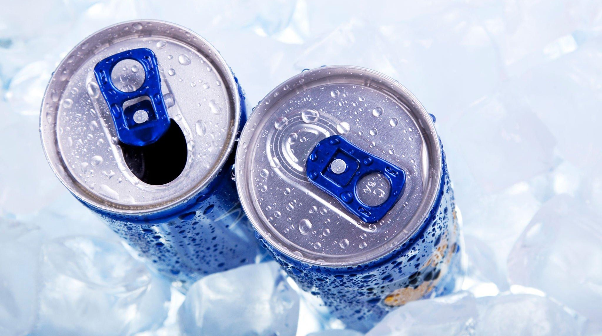

# Codex Beverages Survey Data Analysis[^1]

## Introduction
This is an analysis report of the survey conducted on behalf of CodeX Beverage Company. This comprehensive study aimed to gain valuable insights into consumer preferences, competition analysis, brand awareness and perception, purchase behavior, and product development. I have been able to explore key trends and patterns from the survey data that will help inform strategic decisions and optimize marketing efforts.

## Problem Statement
CodeX is experiencing heightened competition and shifting consumer preferences since they launched their energy drink in 10 cities in India few months back. To address these challenges, the company seeks to understand its target audience better. By analyzing the survey data, I aim to equip the marketing team at CodeX with relevant insights that will help strengthen its competitive edge.

## Approach
I utilized Microsoft Power BI for the data exploration, analysis, and visualization. With this tool, I discovered key findings to drive informed decisions.

## Skills Demonstrated
The following skills were demonstrated during the course of the project:
- Data exploration
- Data visualization
- Data analysis
- Filtering and slicing
- Interactive dashboard
- Measures and calculated columns using DAX
- Data storytelling
- Research skills

## Visualizations
The visualization is a 7-page report. Click the image below to view the visualizations that have been converted into a PDF format:

_Interact with the dashboard by downloading the Power BI file from the files in the repository_

## Relevant Insights
Through a comprehensive analysis of the survey data, I have gained valuable insights into the preferences, behaviors, and perception of our respondents. The following list highlights the key findings and trends that emerged from the survey responses:
-	70% of the respondents are youths and have demonstrated significant preference for energy drinks, indicating an excellent opportunity to connect with them.
-	60% of the respondents are male which indicates a strong male customer base
-	Online ads are the most effective marketing channel reaching the youths (15-30) at 48% effectiveness. This is followed by TV commercials at 25% and the least effective being the Print media with only 6% effectiveness.
-	The top 3 cities reached by Online ads include Bangalore, Hyderabad, and Mumbai which are Tier 1 cities
-	The top 3 cities reached by TV commercials include Mumbai, Bangalore, and Pune.
-	There is a notable preference for compact, portable, and innovative bottle design among the respondents.
-	The primary reason why consumers prioritize the current brands in the market over CodeX is Brand reputation.
-	The overall rating of CodeX energy drink based on taste experience is 3.29/5.
-	Only 44.47% of the respondents are aware the brand, indicating an opportunity for CodeX to increase its visibility and reach a larger portion of the target market by targeting the remaining 55.53% who are not aware.
-	45% of the consumers get their energy drinks from supermarkets while 25% and about 15% patronize online retailers and fitness centers respectively.  
-	The noteworthy situations that prompt the consumption of energy drinks among consumers are physical activities (sports and exercise) and mental energy boost (studying/working late)
- The youths (15-30) prefer the price range between 50 and 99 while the middle-aged adults (31-45) prefer it at 100 to 150.  It is important to strategically put an ideal price on the products.
- 54% have not tried the brand for the following reasons:
    -    No interest in energy drinks
    -    Health concerns
    -    Not available locally
    -    Unfamiliarity with the brand
-	Consumers have health concerns and are interested in organic ingredients and reduced sugar content

## Recommendations
Based on the insights that I have derived from the comprehensive analysis of the survey data, I am proposing the following strategic recommendations to enhance CodeX Energy Drink’s market positioning, optimize customer engagement and drive growth opportunities:
-	Prioritize online ads to reach the youths and middle-aged adults and be more strategic with TV commercials which has proven to be most effective in Pune
- Consider formulating energy drinks with organic ingredients and reduced sugar content to address consumers’ concerns about the health impacts of energy drinks.
-	Integrate online influencers strategically with limited edition packaging to provide optimal effectiveness of the marketing campaigns
-	Select a brand ambassador that is notably influential among youths and middle-aged adults. I recommend Virat Kohli, an Indian international cricketer. With over 250M followers on Instagram and his interest in sports and fitness, Virat Kohli is a good choice of a Brand Ambassador.
-	Make the following group of people and places your target audience:
    -  Athletes and fitness enthusiasts
    -  College students and working professionals
    -  Fitness studios
    -  Libraries
-  By targeting libraries, the brand can reach students studying late hours. Proving energy drinks as study aid during exam periods can attract this audience. However, the brand should emphasize the health and safety aspects of energy drink consumption and address any potential concerns to help build credibility among the chosen target segment, considering the health concerns of consumers. 
-  In order to promote brand reputation, I propose the following:
    -  Quality and safety assurance
    -  Responsible marketing
    -  Transparency in ingredients
    -  Engagement with consumers

**_Thank you_**

[^1]: _Disclaimer: I got the dataset and other files needed to start this project from Codebasics Resume Project Challenge._

